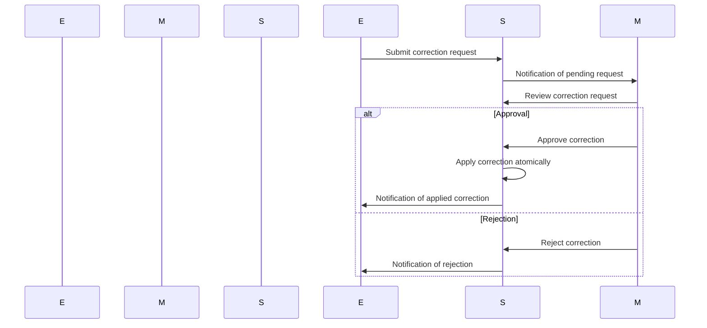
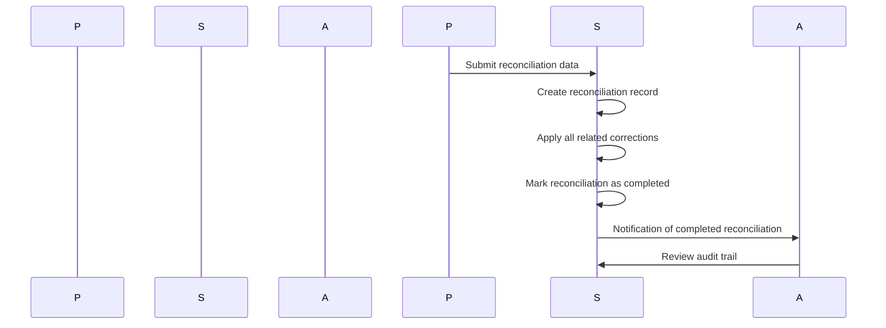

# Attendance Correction Strategy: Safest Long-Term Approach

## Overview

This document describes the safest long-term strategy for attendance correction, manager overrides, and payroll reconciliation while preserving complete audit integrity and preventing data corruption.

## Architecture

### Core Components

1. **AttendanceCorrectionService** (`services/attendanceCorrectionService.js`)
   - **Atomic Operations**: All corrections applied in database transactions
   - **Comprehensive Audit Trail**: Every change tracked with before/after states
   - **Multi-Type Support**: Manual adjustments, manager overrides, system errors, payroll reconciliation
   - **Permission-Based Access**: Role-based correction permissions
   - **Expiration Handling**: Automatic cleanup of expired requests

2. **Database Schema** (`migrations/20250513000000_attendance_corrections.sql`)
   - **Corrections Table**: Request tracking with approval workflow
   - **Audit Trail Table**: Complete before/after state capture
   - **Payroll Reconciliation**: Discrepancy tracking and resolution
   - **Enhanced Shifts Table**: Correction flags and metadata

3. **API Endpoints** (`routes/attendanceCorrections.js`)
   - **Request Management**: Create, approve, reject corrections
   - **History Tracking**: Complete correction and audit history
   - **Payroll Tools**: Reconciliation with discrepancy analysis
   - **Manager Dashboard**: Pending approvals and oversight tools

## Safety Principles

### 1. **Atomic Operations**
```javascript
// All corrections applied in single transaction
await query('BEGIN');
try {
  // Apply correction
  await query('UPDATE shifts SET ...');
  await query('INSERT INTO audit_trail ...');
  await query('COMMIT');
} catch (error) {
  await query('ROLLBACK');
  throw error;
}
```

### 2. **Complete Audit Trail**
```javascript
// Before/after state capture for every change
const auditId = await createAuditTrail({
  requestId,
  managerId,
  action: 'correction_applied',
  beforeData: originalShiftData,
  afterData: correctedShiftData,
  metadata: {
    correctionType: 'MANUAL_ADJUSTMENT',
    timestamp: new Date().toISOString(),
    userAgent: req.get('User-Agent')
  }
});
```

### 3. **Permission-Based Access Control**
```javascript
// Role-based correction permissions
const permissions = {
  admin: ['attendance_correction', 'payroll_reconciliation'],
  manager: ['attendance_correction'],
  hr: ['attendance_correction'],
  employee: []
};

// Middleware enforcement
const requireCorrectionPermission = (permission) => {
  return async (req, res, next) => {
    const hasPermission = user.permissions.includes(permission) || user.role === 'admin';
    if (!hasPermission) {
      return res.status(403).json({ error: 'Insufficient permissions' });
    }
    next();
  };
};
```

## Correction Types

### 1. Manual Adjustments
```javascript
// Employee requests for small time corrections
{
  type: 'MANUAL_ADJUSTMENT',
  reason: 'Forgot to clock out for lunch',
  originalData: { clock_out_time: '2025-01-15T17:30:00Z' },
  correctedData: { clock_out_time: '2025-01-15T18:00:00Z' },
  requestedBy: 'employee123'
}
```

### 2. Manager Overrides
```javascript
// Manager corrections for business reasons
{
  type: 'MANAGER_OVERRIDE',
  reason: 'Employee arrived late due to traffic',
  originalData: { clock_in_time: '2025-01-15T09:15:00Z', is_late: true },
  correctedData: { clock_in_time: '2025-01-15T09:00:00Z', is_late: false },
  overrideBy: 'manager456'
}
```

### 3. System Error Corrections
```javascript
// Automatic corrections for system errors
{
  type: 'SYSTEM_ERROR',
  reason: 'GPS coordinates failed to save, using manual entry',
  originalData: { clock_out_lat: null, clock_out_lng: null },
  correctedData: { clock_out_lat: 40.7128, clock_out_lng: -74.0060 },
  system_correction: true
}
```

### 4. Payroll Reconciliation
```javascript
// Bulk payroll corrections with audit trail
{
  type: 'PAYROLL_RECONCILIATION',
  periodStart: '2025-01-01',
  periodEnd: '2025-01-31',
  originalTotals: { total_hours: 168.5, total_employees: 25 },
  correctedTotals: { total_hours: 169.25, total_employees: 25 },
  discrepancyAmount: 0.75,
  discrepancyReason: 'GPS tracking corrections',
  corrections: [correctionId1, correctionId2]
}
```

## API Endpoints

### Correction Management
```
POST /api/attendance-corrections/requests
POST /api/attendance-corrections/approve
POST /api/attendance-corrections/reject
GET  /api/attendance-corrections/history
GET  /api/attendance-corrections/pending
```

### Payroll Operations
```
POST /api/attendance-corrections/reconcile
GET  /api/attendance-corrections/reconciliations
GET  /api/attendance-corrections/audit/:requestId
```

## Workflow Processes

### 1. Employee Correction Request


### 2. Payroll Reconciliation


## Safety Guarantees

### 1. **Data Integrity**
- **Atomic Transactions**: All-or-nothing corrections
- **Rollback Capability**: Failed corrections don't corrupt data
- **State Validation**: Invalid corrections rejected before application
- **Concurrency Control**: Row-level locking prevents simultaneous corrections

### 2. **Audit Completeness**
- **Before/After States**: Complete state capture for every change
- **User Attribution**: Every correction tied to requesting/approving user
- **Timestamp Accuracy**: Precise timing of all operations
- **Metadata Capture**: Rich context for every correction

### 3. **Access Control**
- **Role-Based Permissions**: Different access levels for different operations
- **Company Isolation**: Corrections isolated by company
- **Expiration Handling**: Old requests automatically cleaned up
- **Approval Workflow**: Multi-level approval for sensitive changes

### 4. **Recovery Capabilities**
- **Correction Reversion**: Ability to undo applied corrections
- **Conflict Resolution**: Handling of overlapping corrections
- **Partial Recovery**: Recovery from failed correction batches
- **Emergency Fixes**: Critical error corrections bypass normal workflow

## Implementation Benefits

### For Development Team
1. **Atomic Operations**: Database-level transaction safety
2. **Comprehensive Testing**: Full test coverage for correction workflows
3. **Audit Trail Integration**: All corrections automatically logged
4. **Permission System**: Built-in access control for all operations
5. **Error Handling**: Robust error recovery and rollback

### For Operations Team
1. **Manager Dashboard**: Centralized correction oversight
2. **Approval Workflow**: Streamlined manager approval process
3. **Audit Compliance**: Complete audit trail for regulatory requirements
4. **Payroll Accuracy**: Automated discrepancy detection and correction
5. **Risk Mitigation**: Permission-based access and expiration handling

### For Finance/Payroll
1. **Accurate Reconciliation**: Automated discrepancy calculation
2. **Audit Trail Access**: Complete history of all corrections
3. **Correction Tracking**: Link between corrections and payroll adjustments
4. **Compliance Reporting**: Detailed reports for audits
5. **Data Integrity**: Guaranteed atomic correction application

## Risk Mitigation

### 1. **Data Corruption Prevention**
- **Atomic Transactions**: Never leave data in inconsistent state
- **Rollback on Failure**: Automatic cleanup of partial corrections
- **State Validation**: Reject invalid corrections before database changes
- **Concurrency Control**: Row-level locking prevents race conditions

### 2. **Unauthorized Access Prevention**
- **Role-Based Permissions**: Only authorized users can make corrections
- **Approval Requirements**: Sensitive corrections require manager approval
- **Audit Logging**: All access attempts logged for security
- **Session Validation**: User sessions validated for all operations

### 3. **Payroll Accuracy Protection**
- **Discrepancy Tracking**: All payroll differences identified and tracked
- **Correction Linkage**: Payroll changes linked to specific corrections
- **Automated Calculations**: Reduce human error in payroll processing
- **Reconciliation Validation**: Period-end validation and cross-checks

## Long-Term Strategy

### Phase 1: Foundation (Week 1-2)
- Implement core correction service with atomic operations
- Create database schema with audit trail
- Build basic API endpoints for correction requests
- Add permission-based access control

### Phase 2: Manager Tools (Week 3-4)
- Develop manager approval dashboard
- Implement correction history and audit trail APIs
- Add notification system for correction requests
- Create correction analytics and reporting tools

### Phase 3: Payroll Integration (Week 5-6)
- Build payroll reconciliation system
- Integrate with existing payroll processing
- Add discrepancy detection and automated corrections
- Implement compliance reporting and audit tools

### Phase 4: Advanced Features (Week 7-8)
- Add machine learning for anomaly detection
- Implement predictive correction suggestions
- Build advanced analytics dashboard
- Add automated correction workflows
- Integrate with external payroll systems

## Compliance and Audit

### Regulatory Requirements
- **Complete Audit Trail**: Every change logged with user attribution
- **Data Retention**: Configurable retention policies for audit data
- **Access Controls**: Role-based permissions with audit logging
- **Change Management**: Version control for all attendance corrections
- **Reporting**: Comprehensive compliance and audit reporting

### Audit Trail Contents
```javascript
// Complete audit record for every correction
{
  id: 'uuid',
  correction_request_id: 'uuid',
  manager_id: 'uuid',
  company_id: 'uuid',
  action: 'correction_applied',
  before_data: { /* original shift data */ },
  after_data: { /* corrected shift data */ },
  metadata: {
    correctionType: 'MANUAL_ADJUSTMENT',
    timestamp: '2025-01-15T10:30:00Z',
    ipAddress: '192.168.1.100',
    userAgent: 'Mozilla/5.0...',
    approvalNotes: 'Manager approved time correction'
  },
  created_at: '2025-01-15T10:30:00Z'
}
```

This strategy provides the **safest possible approach** to attendance corrections while maintaining complete audit integrity and preventing data corruption through atomic operations, comprehensive logging, and role-based access controls.
